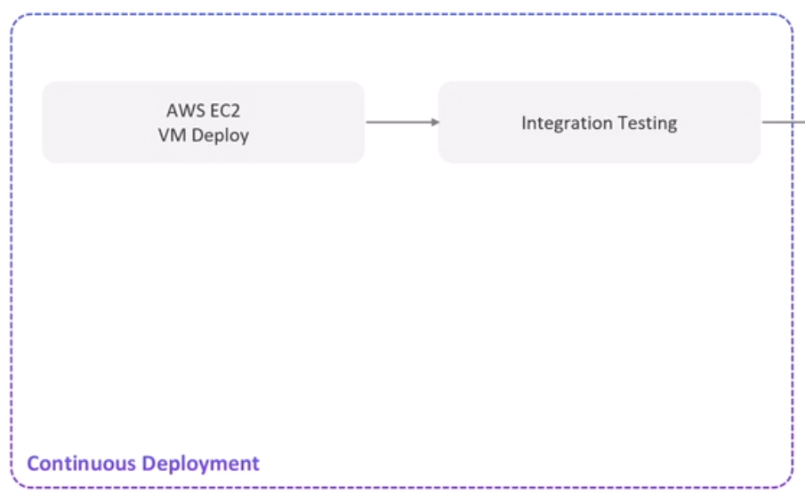
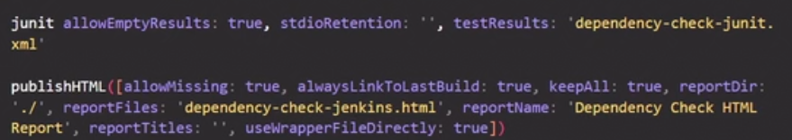
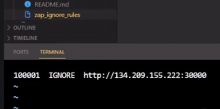

Code coverage is a measure of how much of your source code is executed (run) when your tests are run.

In simple words:

👉 It tells you how well your tests are checking your code.

### what we are going to do ?

continous integration steps :
1-build / install dependencies
2-OWASP Dependency check  Open Worldwide Application Security Project
It scans your project for dependencies (e.g., JARs in Java, packages in Python, etc.) and checks if any of them have known security vulnerabilities by comparing them against publicly available databases like the National Vulnerability Database (NVD).
3-code coverage (unit testing)
4-SAST Static Application Security Testing sonarqube
5-Docker build and vulnerability test using trivy It extracts and inspects all the layers of your Docker image (from base image to your added files).
after all of that we will push the image 

Integration testing (Test interactions between components/modules) : Integration Testing is a type of software testing where individual components or modules are combined and tested as a group to check how well they work together.
must done when app is running so you must deploy application first 

## continous deployment

1- deploy on ec2 in aws
2- run integration testing on it

Testing levels 

Testing Level	Focus
Unit Testing	Test individual functions/modules in isolation
Integration Testing	Test interactions between components/modules
System Testing	Test the whole system as one unit
Acceptance Testing	Test from the user's point of view

Nice! Let’s dive into DAST and its relationship with OWASP 🔍💥

🔍 What is DAST?
DAST stands for Dynamic Application Security Testing.

It’s a black-box testing technique that scans a running application (usually web apps) to find security vulnerabilities from the outside in — just like an attacker would.

🎯 How DAST works:
The app must be running

DAST tools crawl through your app, like a user or hacker would

They send various requests, payloads, and attacks to test:

SQL Injection

Cross-Site Scripting (XSS)

Broken authentication

Security misconfigurations

And more…

DAST doesn’t know the internal code — it just sees the app like a user would (black-box testing).

## continous delivery

1- Argocd and Kubernetes deploy
2-Dast owasp zap
3- approval stage
4- aws lambda deploy 
5- aws lambda invocation/testing

## post build b3d CI/CD

1- Reports
2- post reports to s3
3- slack notify for all states and stages

## how to install maven in jenkins and use in pipeline (not on the host but on jenkins)

 Step 1: Install Maven in Jenkins
🧩 Option A: Install via Jenkins GUI (recommended)
Go to Jenkins Dashboard → Manage Jenkins → Global Tool Configuration

Scroll to Maven section

Click "Add Maven"

Give it a name (e.g., Maven 3.8.7)

Check "Install automatically" and choose a version

## how to use in a pipeline

pipeline {
    agent any

    tools {
        maven 'Maven 3.8.7'  // Use the same name as defined in Jenkins Tools
    }

    stages {
        stage('Build') {
            steps {
                sh 'mvn clean install'
            }
        }
    }
}

## Step 1: Install the NodeJS Plugin in Jenkins
Go to Jenkins Dashboard → Manage Jenkins → Manage Plugins

Click on the Available tab

Search for “NodeJS”

Check the box next to NodeJS Plugin

Click Install without restart or Download now and install after restart

## Step 2: Configure NodeJS in Jenkins
After plugin installation:

Go back to Manage Jenkins → Global Tool Configuration

Scroll down and you should now see a “NodeJS” section

Click Add NodeJS

Give it a name like Node 18

Check "Install automatically"

Choose a version (e.g., 18.x or 20.x)

pipeline {
    agent any

    tools {
        nodejs 'Node 18'  // The same name you used in Global Tool Configuration
    }

    stages {
        stage('Install & Build') {
            steps {
                sh 'npm install'
                sh 'npm run build'
            }
        }
    }
}

## not all things you can install like this 
## docker must install on the host terraform also

## 🧑‍💻 Multibranch Pipeline:
A Multibranch Pipeline is designed to automatically create a pipeline for each branch in a repository. It makes use of Jenkins' ability to discover all branches in a source control system (e.g., Git) and create separate pipeline jobs for each of them.

## 🏢 Organization Folder: (more preferred)
An Organization Folder is a feature specific to GitHub Organization or Bitbucket Team integration. It is used to automatically discover and manage Jenkins projects (pipelines) across multiple repositories within a GitHub Organization or Bitbucket Team.
Automatic multibranch pipeline discovery: For each repository, it will automatically create a Multibranch Pipeline job, meaning each repository will have individual pipeline jobs for each branch.

### to add github webhooks automatically from jenkines

Step 1: Install the GitHub Plugin in Jenkins
Go to Jenkins Dashboard → Manage Jenkins → Manage Plugins.

In the Available tab, search for GitHub Plugin.

Check the box next to the plugin and click Install without restart (or restart Jenkins if needed).

✅ Step 2: Configure GitHub Plugin in Jenkins
Go to Manage Jenkins → Configure System.

Scroll down to the GitHub section.

Click Add GitHub Server and then Add to connect your GitHub account.

You can use OAuth or Personal Access Token for authentication.

Test the connection to ensure Jenkins is connected to GitHub.

✅ Step 3: Enable Automatic Webhook Management
After configuring the GitHub plugin:

Go to your Multibranch Pipeline or Freestyle Job configuration in Jenkins.

In the Source Code Management section, select Git.

Add your GitHub repository URL (e.g., https://github.com/user/repository.git).

Check the box “GitHub hook trigger for GITScm polling” under the Build Triggers section.

When this option is selected, Jenkins will:

Automatically create a GitHub webhook when the repository is linked.

Ensure Jenkins is notified when any changes happen in your GitHub repository (like commits, pull requests, etc.).

Part 2: GitHub Webhook Setup
1. Create the Webhook in GitHub
Go to your GitHub repository

Click Settings > Webhooks > Add webhook

Configure the webhook:

Payload URL: http://your-jenkins-server/github-webhook/
(or https:// if you have SSL configured)

Content type: application/json

Secret: (optional but recommended) - create a secret and note it down

Which events: "Just the push event" (or select based on your needs)

Click Add webhook

## to make jenkins in a private subnet must attach to it a loadbalancer to access it

## loadbalancer y3ml connect ma3 ec2 fi private http
## bastion ec2 y3ml connect ma3 ec2 fi private ssh

## Dependency Scanning
using npm audit
you will give error to stop pipeline if one critical vilnerability found

now we will use other tool 
plugin needed OWASP Dependency-check
have publiser option out result in many formats
after install plugin add it to tools on jenkins
we will run both in a parallel pipeline as the dont depend in each other
reports called dependency-check-jenkins.html // have oher than that
you need dependencyCheckPublisher to block pipeline if critical found and wll publish report in jenkins
 

Report File	Format	Purpose	Used For
dependency-check-report.xml	XML	Machine-readable	Jenkins processing, build decisions, integrations
dependency-check-jenkins.html	HTML	Human-readable (detailed)	Viewing in browser or Jenkins for analysis
dependency-check-junit.html	HTML	JUnit-style summary report	Quick CI dashboards, test-result-like overview

we will publish two reports to be easily seen by developers
you may need to allow css on the node pipeline work 

here we publish two reports in jenkins

## we will add environment variables and use credentials for mongodb at time of unittesting for username and password passing and publish report of unit testing

## options directive in jenkins 

some are for stage
options { timestamps() }
options{retry(2) } -> if stage fail will run again 

some are global

options {
    disableResume()
    disableConcurrentBuilds abortPrevious: true
}

✅ What is Code Coverage?
Code coverage is a metric used to measure how much of your source code is executed (or "covered") by your unit tests.

Think of it like this:

You wrote 100 lines of code.

You have tests that only check 60 lines.

Your code coverage is 60%.

🔍 Why is it Important?
It helps you find untested parts of your code.

High coverage doesn’t always mean good tests, but low coverage usually means parts of your app are not well-tested.

It’s used in CI/CD pipelines to make sure critical logic is not left untested.

⏱️ Does it have to come after Unit Testing?
Yes — always run your tests first. Code coverage tools depend on running tests to measure coverage. 

## to catch error in pipeline and continue
catchError(buildResult: 'SUCCESS', message: "it will be fixed later", stageResult: 'UNSTABLE') {
    sh 'npm run coverage'
}

🛡️ catchError(...) { ... }
This block catches any error inside it and lets you decide what to do instead of failing the build.

👇 Parameter breakdown:
Parameter	Meaning
buildResult: 'SUCCESS'	The overall Jenkins build status will still be marked as SUCCESS even if the command fails.
stageResult: 'UNSTABLE'	This specific stage will be marked as UNSTABLE (yellow ball), not failed.
message: "it will be fixed later"	A custom message that shows up in the Jenkins console/logs.

## How coverage fail
## developers define percentage in json files if passed no error happens 

## we need to save credentials in all stages how we will do that
## i have credentials username and password
## i need to make each of them as secret text and in pipeline as environment variables
environment{
    MONGO_USERNAME = credentials('mongo-db-username')  // MONGO_USERNAME must same name in code
    MONGO_PASSWORD = credentials('mongo-db-password')
}

## i will publish all documents at the end of pipeline either succeed or failed
post {
    always{
        junit ------
        publishHTML --------
    }
}

environment {
    MY_CRED = credentials('mycred') // if this cred is username and password
}
to access username $MY_CRED_USR
to access password $MY_CRED_PSW

✅ What is SonarQube?
SonarQube is a tool that analyzes your source code to:

Detect code quality issues

Identify security vulnerabilities

Enforce coding standards

Track technical debt
How SonarQube performs SAST:
SAST means scanning your source code (without executing it) to find security issues such as:

SQL injection

Cross-site scripting (XSS)

Hardcoded secrets

Insecure APIs

Broken access control patterns

Quality Gates: Allows setting security thresholds that must be met to pass pipeline

## add sonarqube to jenkins 
## first setup sonarqube server and make new project in sonarqube and generete Token
## go to jenkins and setup sonarqube scanner --> this the tool which scans all the code then send to reports to sonarqube server
## then to tool add sonar qube scanner 
## the code used to scan code in jenkins by sonar-scanner then send results to sonar server 

-Dsonar.sources=app.js \ --> you can change it to ./ but it will take more time

## environment variable of scanner

## we will need to add quality gate to invoke pipeline if sonarqube failed
##  we will need sonarqube to send webhook after sending results the webhook contain fail or succeed

## first from sonarqube configure a webhook to jenkins
 

## we need to secure our sonarqube and not add token in jenkins
## we will connect jenkins with sonarqube server as the connect of jenkins and github
## create a secret text from sonarqube token

## now we will remove token from pipeline and wait for quality gate

## now we will build the dockerimage 
## dont forget to add .dockerignore as we copy all files in dockerfile
## for env variables we are passing dummy data and real data will be passed during running

Trivy is a security scanner for containers, code, and infrastructure — very popular in DevSecOps pipelines.

🔍 What is Trivy?
Trivy (by Aqua Security) is an open-source vulnerability scanner that detects:

✅ OS-level vulnerabilities (in packages like openssl, glibc, etc.)
✅ Application dependencies (e.g., npm, pip, Maven)
✅ Misconfigurations (e.g., Dockerfile, Kubernetes YAMLs)
✅ Infrastructure as Code issues (Terraform, CloudFormation)
✅ Secrets (e.g., hardcoded passwords or keys)

## you will need to setup trivy on jenkins host as docker above

## how to use trivy with docker images

stage('Trivy Vulnerability Scanner') {
    steps {
        // Scan for MEDIUM/LOW severity (report only)
        sh '''
            trivy image siddharth67/solar-system:$GIT_COMMIT \
            --severity LOW,MEDIUM,HIGH \
            --exit-code 0 \
            --quiet \
            --format json \
            -o trivy-image-MEDIUM-results.json
        '''
        
        // Scan for CRITICAL/HIGH severity (fail pipeline if found)
        sh '''
            trivy image siddharth67/solar-system:$GIT_COMMIT \
            --severity CRITICAL \
            --exit-code 1 \
            --quiet \
            --format json \
            -o trivy-image-CRITICAL-results.json || echo "Critical vulnerabilities found!"
        '''
    }
  
}

## the generated reports are in json format . must start with json format and we can reformat to html and xml
## the xml will be used for junit
post {
    always {
        sh '''
        trivy convert \
            --format template --template "@/usr/local/share/trivy/templates/html.tpl" \
            --output trivy-image-MEDIUM-results.html trivy-image-MEDIUM-results.json
        trivy convert \
            --format template --template "@/usr/local/share/trivy/templates/html.tpl" \
            --output trivy-image-CRITICAL-results.html trivy-image-CRITICAL-results.json
        trivy convert \
            --format template --template "@/usr/local/share/trivy/templates/junit.tpl" \
            --output trivy-image-MEDIUM-results.xml  trivy-image-MEDIUM-results.json
        trivy convert \
            --format template --template "@/usr/local/share/trivy/templates/junit.tpl" \
            --output trivy-image-CRITICAL-results.xml trivy-image-CRITICAL-results.json
        '''
    }
}

## you will need to publish them at the end of pipeline

## to push docker image to docker repository you will need docker pipeline plugin
## you need to create credientails username and password of docker 

### Now we are going to deploy on amazon ec2 we created public ec2 and save public key on it

### now we  want to install aws steps plugin 
### then create aws credential  Access key ID , Secret Access Key .. -
### then we want to install ssh agent plugin 
### then create credential SSH username with private key
### the code used to deploy container on ec2

## we when to only run on any feature/* branch
## we used scrpt as we have if condition
## ssh agent need credential id of ssh 
## first we clear env before runnig new container 
## the ip of ec2 is hardcoded we will make it dynamic
## StrictHostKeyChecking=no to prevent asking in ssh

## Integration testing is a level of software testing where individual units or components of an application are combined and tested together to ensure that they work as expected when integrated.
## we will do that by bash script to test ec2 and app
## we will need to setup aws cli on the host
## we will use aws credetials as inside bash script we use aws which need credentials

## The difference between Continuous Delivery and Continuous Deployment is small but important — it’s all about who or what decides when to release the code to production. 

Continuous Delivery (CD)
"Automatic until production — then manual."

Continuous Deployment
"Fully automatic — no human required."

## now we are using argocd . we install on the cluster and make application
## argo applicaton connected with github when manifests change should be triggered and deploy them
## in our pipeline we will trigger stage if a pull request is triggered only
## this stage clone manifests and change the image in this manifests
## Push the new manifests in another branch in same repo argocd listen to
## to trigger argo you will need also to make pull request and accept it to 
## send new manifests  file uploaded to main where argocd listen to this branch

the pipeline which used to trigger argocd

sed Overview
sed is a stream editor used to perform basic text transformations.

The syntax here is:
sed -i "s#pattern#replacement#g" file

## dont forget to remove what you cloned at post
   script {
    if (fileExists('solar-system-gitops-argocd')) {
         sh 'rm -rf solar-system-gitops-argocd'
         
         }
            }
## then he tried to make pull request in argocd repo auto only need o accept merge

## Dynamic Application security testing
DAST stands for Dynamic Application Security Testing.

🔍 What is DAST?
DAST is a black-box security testing method used to find vulnerabilities in a running application (usually web apps or APIs). It simulates how an attacker would interact with your app from the outside, without access to source code.

Think of it like ethical hacking — sending inputs, clicking buttons, and analyzing the output to find issues.

## DAST needs running application must be running

## we wlll use free tool zap (zed attack proxy)
ZAP used web apps
## use docker images of zap in CI/CD
https://www.zaproxy.org/docs/docker/

⚡ 1. Baseline Scan
"A time-limited spider which reports issues found passively"

✅ What it does:

Quickly crawls your app (within a time limit).

Looks for issues without sending any malicious payloads (passive scan).

❌ No active attacks, so it's safe to run even on production.

🚀 Useful for quick security checks in CI/CD.

🛡️ 2. Full Scan
"A full spider, optional ajax spider and active scan which reports issues found actively and passively"

✅ What it does:

Fully crawls your website (including JavaScript-heavy parts if you use the AJAX spider).

Performs both:

Passive scan (like Baseline Scan)

Active scan: sends attack payloads (e.g., for XSS, SQLi, etc.)

🚫 Not recommended on production, but powerful in staging/dev environments.

🔌 3. API Scan
"A full scan of an API defined using OpenAPI / Swagger, or GraphQL (post 2.9.0)"

✅ What it does:

Reads your API documentation (OpenAPI/Swagger or GraphQL).

Tests the endpoints with both passive and active scans.

🤖 Ideal for scanning REST or GraphQL APIs automatically.

🔄 4. Scan Hooks
"To make it easy to make little tweaks here and there a hook system is in place to assist you with the packaged scans"

✅ What it does:

Lets you customize the scan behavior.

You can inject scripts or settings at specific stages of the scan.

🛠️ Useful when you want to:

Change authentication methods

Add custom headers

Tweak scan rules

## we will use api scan 
## dir('subfolder'){

} //outside it you return to default working space 

## When you configure Jenkins to checkout a Git repository from the SCM (Source Code Management) section in the job configuration (instead of manually using git or checkout in the Pipeline script), Jenkins 
## automatically checks out the code into the workspace root (not a subdirectory). 
# we will use api scan
# before running the scan we need to make sure that the pull request in argocd is applied
## we will add input to ask if this done and argocd is synced in a stage before applying DAST
## if you dont do this check you can apply the test on an old version
## stage('App Deployed') {
    when {
        branch 'PR*'
    }
    steps {
        timeout(time: 1, unit: 'DAYS') {
            input message: 'Is the PR Merged and ArgocD Synced?', ok: 'YES! PR is Merged and ArgocD Appli'
        }
    }
}

## in dast if there is a warning it may fail we need to ignore that 

# you can ignore DAST IGNORE Rules  as warning block pipeline
## add the file and this to run command 

## now we will upload reports to s3 bucket

## to add a layer of security you can input only admins in jenkins can submit it

### Lambda and deployment on lambda
